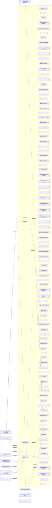

# Domain: 10. Platform foundation

```mermaid
flowchart LR
  subgraph "Platform foundation"
    repo_agilecontent_AgilePlatformTool["AgilePlatformTool"]
    repo_agilecontent_CMSE_Infra["CMSE-Infra"]
    repo_agilecontent_MibDocs["MibDocs"]
    repo_agilecontent_Modern_Architecture_Template["Modern-Architecture-Template"]
    repo_agilecontent_TO_DELETE_AgileRoleDocker["TO_DELETE_AgileRoleDocker"]
    repo_agilecontent_agile_java_base["agile-java-base"]
    repo_agilecontent_agile_devops["agile_devops"]
    repo_agilecontent_agilecd_hub_lowi_pro_infra["agilecd-hub-lowi-pro-infra"]
    repo_agilecontent_agiledm_hub_adm_europe_01_pro_infra["agiledm-hub-adm-europe-01-pro-infra"]
    repo_agilecontent_agiledm_hub_role_admservers["agiledm-hub-role-admservers"]
    repo_agilecontent_agiledm_test_qa_jenkins["agiledm-test-qa-jenkins"]
    repo_agilecontent_agileproducts_devops["agileproducts-devops"]
    repo_agilecontent_agiletv_bastion_agiletv_scripts["agiletv-bastion-agiletv-scripts"]
    repo_agilecontent_agiletv_devops_install_script["agiletv-devops-install-script"]
    repo_agilecontent_agiletv_docker_distroless_java_17["agiletv-docker-distroless-java-17"]
    repo_agilecontent_agiletv_gcp["agiletv-gcp"]
    repo_agilecontent_agiletv_gcp_adm_cloud_dev["agiletv-gcp-adm-cloud-dev"]
    repo_agilecontent_agiletv_gcp_apps_dev["agiletv-gcp-apps-dev"]
    repo_agilecontent_agiletv_gcp_apps_pro["agiletv-gcp-apps-pro"]
    repo_agilecontent_agiletv_github_actions["agiletv-github-actions"]
    repo_agilecontent_agiletv_hub_brasil_infra["agiletv-hub-brasil-infra"]
    repo_agilecontent_agiletv_hub_europe_infra["agiletv-hub-europe-infra"]
    repo_agilecontent_agiletv_hub_europe_pro_infra["agiletv-hub-europe-pro-infra"]
    repo_agilecontent_agiletv_hub_itaas_infra["agiletv-hub-itaas-infra"]
    repo_agilecontent_agiletv_hub_itaas_playbook["agiletv-hub-itaas-playbook"]
    repo_agilecontent_agiletv_hub_k8s_europe_pre["agiletv-hub-k8s-europe-pre"]
    repo_agilecontent_agiletv_hub_k8s_infra["agiletv-hub-k8s-infra"]
    repo_agilecontent_agiletv_hub_latam_infra["agiletv-hub-latam-infra"]
    repo_agilecontent_agiletv_hub_latam_playbook["agiletv-hub-latam-playbook"]
    repo_agilecontent_agiletv_hub_mib_playbook["agiletv-hub-mib-playbook"]
    repo_agilecontent_agiletv_hub_role_bastion["agiletv-hub-role-bastion"]
    repo_agilecontent_agiletv_hub_role_tomcat["agiletv-hub-role-tomcat"]
    repo_agilecontent_agiletv_k8s_charts["agiletv-k8s-charts"]
    repo_agilecontent_agiletv_k8s_configs["agiletv-k8s-configs"]
    repo_agilecontent_agiletv_k8s_europe_apps_devops["agiletv-k8s-europe-apps-devops"]
    repo_agilecontent_agiletv_k8s_europe_apps_pre["agiletv-k8s-europe-apps-pre"]
    repo_agilecontent_agiletv_k8s_europe_apps_pro["agiletv-k8s-europe-apps-pro"]
    repo_agilecontent_agiletv_k8s_europe_utilities_pro["agiletv-k8s-europe-utilities-pro"]
    repo_agilecontent_agiletv_k8s_gcloud_apps_dev["agiletv-k8s-gcloud-apps-dev"]
    repo_agilecontent_agiletv_k8s_onprem_apps_tools["agiletv-k8s-onprem-apps-tools"]
    repo_agilecontent_agiletv_systems_install_playbook["agiletv-systems-install-playbook"]
    repo_agilecontent_agiletv_systems_nginx_copycerts_playbook["agiletv-systems-nginx-copycerts-playbook"]
    repo_agilecontent_agiletv_systems_observabilty_playbook["agiletv-systems-observabilty-playbook"]
    repo_agilecontent_agiletv_systems_pve_playbook["agiletv-systems-pve-playbook"]
    repo_agilecontent_agiletv_systems_role_jenkins["agiletv-systems-role-jenkins"]
    repo_agilecontent_agiletv_systems_role_mib["agiletv-systems-role-mib"]
    repo_agilecontent_agiletv_systems_role_nginx["agiletv-systems-role-nginx"]
    repo_agilecontent_agiletv_systems_role_ovirt["agiletv-systems-role-ovirt"]
    repo_agilecontent_agiletv_systems_role_utilities["agiletv-systems-role-utilities"]
    repo_agilecontent_agiletv_systems_role_vault["agiletv-systems-role-vault"]
    repo_agilecontent_agiletv_vsphere_jenkins["agiletv-vsphere-jenkins"]
    repo_agilecontent_agiletv_web_infra["agiletv-web-infra"]
    repo_agilecontent_architecture_team["architecture-team"]
    repo_agilecontent_cadena100_super_pom["cadena100-super-pom"]
    repo_agilecontent_claude_code_accounts_agiletv["claude_code_accounts_agiletv"]
    repo_agilecontent_claude_code_agiletv["claude_code_agiletv"]
    repo_agilecontent_consolidation_devops_modules["consolidation-devops-modules"]
    repo_agilecontent_devops_agiletv_k8s_templates["devops-agiletv-k8s-templates"]
    repo_agilecontent_devops_aiops_poc["devops-aiops-poc"]
    repo_agilecontent_devops_env_scheduler["devops-env-scheduler"]
    repo_agilecontent_devops_modules["devops-modules"]
    repo_agilecontent_devops_utils["devops-utils"]
    repo_agilecontent_devops_zabbix["devops-zabbix"]
    repo_agilecontent_dockerwebappsPerf_terraform["dockerwebappsPerf_terraform"]
    repo_agilecontent_dojo_github_test["dojo-github-test"]
    repo_agilecontent_eslint_config["eslint-config"]
    repo_agilecontent_eslint_config_personal["eslint-config-personal"]
    repo_agilecontent_fast_devops_modules["fast-devops-modules"]
    repo_agilecontent_fastlane_certificates["fastlane_certificates"]
    repo_agilecontent_gitprotect_test["gitprotect_test"]
    repo_agilecontent_insomnia["insomnia"]
    repo_agilecontent_itaas_devops["itaas-devops"]
    repo_agilecontent_itaas_dotnet_shared["itaas-dotnet-shared"]
    repo_agilecontent_itaas_dotnet_tools["itaas-dotnet-tools"]
    repo_agilecontent_itaas_nodejs_api_framework["itaas-nodejs-api-framework"]
    repo_agilecontent_itaas_nodejs_tools["itaas-nodejs-tools"]
    repo_agilecontent_java_code_style["java-code-style"]
    repo_agilecontent_java_code_style_old["java-code-style-old"]
    repo_agilecontent_keycloak_realm_cloner["keycloak-realm-cloner"]
    repo_agilecontent_megastar_super_pom["megastar-super-pom"]
    repo_agilecontent_panflix_devops["panflix-devops"]
    repo_agilecontent_personal_aws_parameter_store["personal-aws-parameter-store"]
    repo_agilecontent_personal_devex["personal-devex"]
    repo_agilecontent_personal_dotnet_tools["personal-dotnet-tools"]
    repo_agilecontent_personal_infra["personal-infra"]
    repo_agilecontent_personal_tools["personal-tools"]
    repo_agilecontent_personal_vault_server["personal-vault-server"]
    repo_agilecontent_prettier_config["prettier-config"]
    repo_agilecontent_rockfm_super_pom["rockfm-super-pom"]
    repo_agilecontent_rtve_devops["rtve-devops"]
    repo_agilecontent_stylelint_config["stylelint-config"]
    repo_agilecontent_terraform_proton["terraform_proton"]
    repo_agilecontent_test_settings_bot["test-settings-bot"]
    repo_agilecontent_tvopenplatform_devops["tvopenplatform-devops"]
    repo_agilecontent_tvopenplatform_docs["tvopenplatform-docs"]
    repo_agilecontent_tvopenplatform_netcore_common["tvopenplatform-netcore-common"]
    repo_agilecontent_tvopenplatform_node_common["tvopenplatform-node-common"]
    repo_agilecontent_vm_provisioner["vm-provisioner"]
    repo_agiletv_documentation_architecture["architecture"]
  end
  repo_agilecontent_MIBFrontEnd_AgileTV_components_old["MIBFrontEnd-AgileTV-components_old (Experience)"]
  repo_agilecontent_MIBFrontEnd_Enricher_components["MIBFrontEnd-Enricher-components (Experience)"]
  repo_agilecontent_MIBFrontEnd_GVP_components["MIBFrontEnd-GVP-components (Experience)"]
  repo_agilecontent_MibFrontEnd["MibFrontEnd (Experience)"]
  repo_agilecontent_MibFrontEnd_samples["MibFrontEnd-samples (Experience)"]
  repo_agilecontent_agile_prism_web["agile-prism-web (Experience)"]
  repo_agilecontent_cdn_director_gui["cdn-director-gui (Delivery)"]
  repo_agilecontent_cope_liturgia_cee_web["cope-liturgia-cee-web (Content supply chain)"]
  repo_agilecontent_puc_frontend["puc-frontend (Content supply chain)"]
  repo_agilecontent_wbc_push["wbc-push (Content supply chain)"]
  repo_agilecontent_wbc_remote["wbc-remote (Content supply chain)"]
  repo_agilecontent_puc_frontend -.->|depends_on| repo_agilecontent_eslint_config
  repo_agilecontent_puc_frontend -.->|depends_on| repo_agilecontent_prettier_config
  repo_agilecontent_puc_frontend -.->|depends_on| repo_agilecontent_stylelint_config
  repo_agilecontent_agile_prism_web -.->|depends_on| repo_agilecontent_prettier_config
  repo_agilecontent_cope_liturgia_cee_web -.->|depends_on| repo_agilecontent_eslint_config
  repo_agilecontent_cope_liturgia_cee_web -.->|depends_on| repo_agilecontent_prettier_config
  repo_agilecontent_cope_liturgia_cee_web -.->|depends_on| repo_agilecontent_stylelint_config
  repo_agilecontent_MibFrontEnd -.->|depends_on| repo_agilecontent_prettier_config
  repo_agilecontent_stylelint_config -.->|depends_on| repo_agilecontent_prettier_config
  repo_agilecontent_eslint_config -.->|depends_on| repo_agilecontent_prettier_config
  repo_agilecontent_MibFrontEnd_samples -.->|depends_on| repo_agilecontent_eslint_config
  repo_agilecontent_MIBFrontEnd_GVP_components -.->|depends_on| repo_agilecontent_eslint_config
  repo_agilecontent_cdn_director_gui -.->|depends_on| repo_agilecontent_eslint_config
  repo_agilecontent_MIBFrontEnd_AgileTV_components_old -.->|depends_on| repo_agilecontent_eslint_config
  repo_agilecontent_MIBFrontEnd_Enricher_components -.->|depends_on| repo_agilecontent_eslint_config
  repo_agilecontent_wbc_push -.->|depends_on| repo_agilecontent_prettier_config
  repo_agilecontent_wbc_remote -.->|depends_on| repo_agilecontent_prettier_config
```