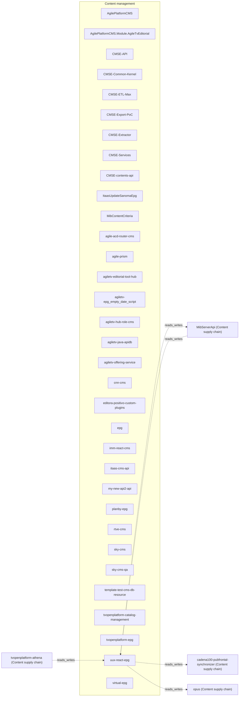

# Domain: 2. Content management

```mermaid
flowchart LR
  subgraph "Content management"
    repo_agilecontent_AgilePlatformCMS["AgilePlatformCMS"]
    repo_agilecontent_AgilePlatformCMS_Module_AgileTvEditorial["AgilePlatformCMS.Module.AgileTvEditorial"]
    repo_agilecontent_CMSE_API["CMSE-API"]
    repo_agilecontent_CMSE_Common_Kernel["CMSE-Common-Kernel"]
    repo_agilecontent_CMSE_ETL_Max["CMSE-ETL-Max"]
    repo_agilecontent_CMSE_Export_PoC["CMSE-Export-PoC"]
    repo_agilecontent_CMSE_Extractor["CMSE-Extractor"]
    repo_agilecontent_CMSE_Services["CMSE-Services"]
    repo_agilecontent_CMSE_contents_api["CMSE-contents-api"]
    repo_agilecontent_ItaasUpdateSanomaEpg["ItaasUpdateSanomaEpg"]
    repo_agilecontent_MibContentCriteria["MibContentCriteria"]
    repo_agilecontent_agile_acd_router_cms["agile-acd-router-cms"]
    repo_agilecontent_agile_prism["agile-prism"]
    repo_agilecontent_agiletv_editorial_tool_hub["agiletv-editorial-tool-hub"]
    repo_agilecontent_agiletv_epg_empty_date_script["agiletv-epg_empty_date_script"]
    repo_agilecontent_agiletv_hub_role_cms["agiletv-hub-role-cms"]
    repo_agilecontent_agiletv_java_apidb["agiletv-java-apidb"]
    repo_agilecontent_agiletv_offering_service["agiletv-offering-service"]
    repo_agilecontent_cnn_cms["cnn-cms"]
    repo_agilecontent_editora_positivo_custom_plugins["editora-positivo-custom-plugins"]
    repo_agilecontent_epg["epg"]
    repo_agilecontent_imm_react_cms["imm-react-cms"]
    repo_agilecontent_itaas_cms_api["itaas-cms-api"]
    repo_agilecontent_my_new_api2_api["my-new-api2-api"]
    repo_agilecontent_planby_epg["planby-epg"]
    repo_agilecontent_rtve_cms["rtve-cms"]
    repo_agilecontent_sky_cms["sky-cms"]
    repo_agilecontent_sky_cms_qa["sky-cms-qa"]
    repo_agilecontent_template_test_cms_db_resource["template-test-cms-db-resource"]
    repo_agilecontent_tvopenplatform_catalog_management["tvopenplatform-catalog-management"]
    repo_agilecontent_tvopenplatform_epg["tvopenplatform-epg"]
    repo_agilecontent_uux_react_epg["uux-react-epg"]
    repo_agilecontent_virtual_epg["virtual-epg"]
  end
  repo_agilecontent_MibServerApi["MibServerApi (Content supply chain)"]
  repo_agilecontent_cadena100_pubfrontal_synchronizer["cadena100-pubfrontal-synchronizer (Content supply chain)"]
  repo_agilecontent_opus["opus (Content supply chain)"]
  repo_agilecontent_tvopenplatform_athena["tvopenplatform-athena (Content supply chain)"]
  repo_agilecontent_MibServerApi -.->|reads_writes| repo_agilecontent_uux_react_epg
  repo_agilecontent_tvopenplatform_athena -.->|reads_writes| repo_agilecontent_uux_react_epg
  repo_agilecontent_uux_react_epg -.->|reads_writes| repo_agilecontent_MibServerApi
  repo_agilecontent_uux_react_epg -.->|reads_writes| repo_agilecontent_cadena100_pubfrontal_synchronizer
  repo_agilecontent_uux_react_epg -.->|reads_writes| repo_agilecontent_opus
```