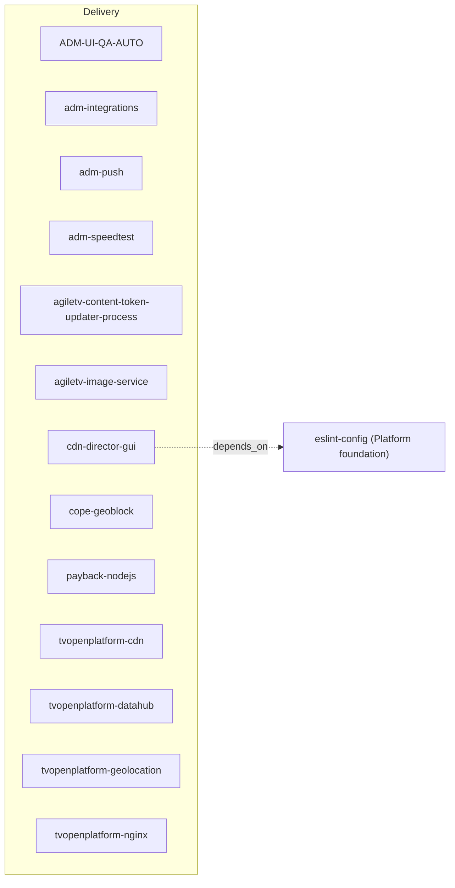

# Domain: 4. Delivery

```mermaid
flowchart LR
  subgraph "Delivery"
    repo_agilecontent_ADM_UI_QA_AUTO["ADM-UI-QA-AUTO"]
    repo_agilecontent_adm_integrations["adm-integrations"]
    repo_agilecontent_adm_push["adm-push"]
    repo_agilecontent_adm_speedtest["adm-speedtest"]
    repo_agilecontent_agiletv_content_token_updater_process["agiletv-content-token-updater-process"]
    repo_agilecontent_agiletv_image_service["agiletv-image-service"]
    repo_agilecontent_cdn_director_gui["cdn-director-gui"]
    repo_agilecontent_cope_geoblock["cope-geoblock"]
    repo_agilecontent_payback_nodejs["payback-nodejs"]
    repo_agilecontent_tvopenplatform_cdn["tvopenplatform-cdn"]
    repo_agilecontent_tvopenplatform_datahub["tvopenplatform-datahub"]
    repo_agilecontent_tvopenplatform_geolocation["tvopenplatform-geolocation"]
    repo_agilecontent_tvopenplatform_nginx["tvopenplatform-nginx"]
  end
  repo_agilecontent_eslint_config["eslint-config (Platform foundation)"]
  repo_agilecontent_cdn_director_gui -.->|depends_on| repo_agilecontent_eslint_config
```