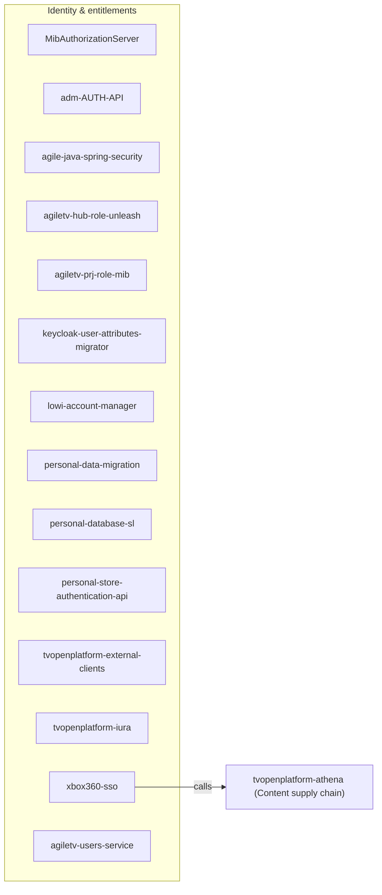

# Domain: 5. Identity & entitlements

```mermaid
flowchart LR
  subgraph "Identity & entitlements"
    repo_agilecontent_MibAuthorizationServer["MibAuthorizationServer"]
    repo_agilecontent_adm_AUTH_API["adm-AUTH-API"]
    repo_agilecontent_agile_java_spring_security["agile-java-spring-security"]
    repo_agilecontent_agiletv_hub_role_unleash["agiletv-hub-role-unleash"]
    repo_agilecontent_agiletv_prj_role_mib["agiletv-prj-role-mib"]
    repo_agilecontent_keycloak_user_attributes_migrator["keycloak-user-attributes-migrator"]
    repo_agilecontent_lowi_account_manager["lowi-account-manager"]
    repo_agilecontent_personal_data_migration["personal-data-migration"]
    repo_agilecontent_personal_database_sl["personal-database-sl"]
    repo_agilecontent_personal_store_authentication_api["personal-store-authentication-api"]
    repo_agilecontent_tvopenplatform_external_clients["tvopenplatform-external-clients"]
    repo_agilecontent_tvopenplatform_iura["tvopenplatform-iura"]
    repo_agilecontent_xbox360_sso["xbox360-sso"]
    repo_agiletv_java_users_agiletv_users_service["agiletv-users-service"]
  end
  repo_agilecontent_tvopenplatform_athena["tvopenplatform-athena (Content supply chain)"]
  repo_agilecontent_xbox360_sso -->|calls| repo_agilecontent_tvopenplatform_athena
```