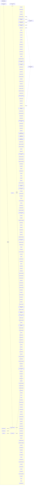

# Domain: 7. Experience

```mermaid
flowchart LR
  subgraph "Experience"
    repo_agilecontent_AndroidTV["AndroidTV"]
    repo_agilecontent_CandidateTesting["CandidateTesting"]
    repo_agilecontent_Chromecast["Chromecast"]
    repo_agilecontent_DevicesDemo["DevicesDemo"]
    repo_agilecontent_MIBFrontEnd_AgileTV_components_old["MIBFrontEnd-AgileTV-components_old"]
    repo_agilecontent_MIBFrontEnd_Enricher_components["MIBFrontEnd-Enricher-components"]
    repo_agilecontent_MIBFrontEnd_GVP_components["MIBFrontEnd-GVP-components"]
    repo_agilecontent_MibFrontEnd["MibFrontEnd"]
    repo_agilecontent_MibFrontEnd_samples["MibFrontEnd-samples"]
    repo_agilecontent_Native["Native"]
    repo_agilecontent_Sonora_iOS["Sonora_iOS"]
    repo_agilecontent_SonoraiOS["SonoraiOS"]
    repo_agilecontent_UUX_new["UUX-new"]
    repo_agilecontent_Vivo_ESPN["Vivo-ESPN"]
    repo_agilecontent_WBC_Demo["WBC-Demo"]
    repo_agilecontent_WBC_Manage_UI["WBC-Manage-UI"]
    repo_agilecontent_WBC_NEXTJS["WBC-NEXTJS"]
    repo_agilecontent_WBC_admin_UI["WBC-admin-UI"]
    repo_agilecontent_WBC_iOS_Mobile["WBC-iOS-Mobile"]
    repo_agilecontent_WeUpdate_NG["WeUpdate_NG"]
    repo_agilecontent_XboxOne["XboxOne"]
    repo_agilecontent_agile_bloomberg_emocion["agile-bloomberg-emocion"]
    repo_agilecontent_agile_bloomberg_emocion_onmobile["agile-bloomberg-emocion-onmobile"]
    repo_agilecontent_agile_content_android_challenge["agile-content-android-challenge"]
    repo_agilecontent_agile_director_front["agile-director-front"]
    repo_agilecontent_agile_itaas_clients["agile-itaas-clients"]
    repo_agilecontent_agile_onmobile["agile-onmobile"]
    repo_agilecontent_agile_play_android["agile-play-android"]
    repo_agilecontent_agile_play_android_app["agile-play-android-app"]
    repo_agilecontent_agile_play_ios["agile-play-ios"]
    repo_agilecontent_agile_play_tvos_tvml["agile-play-tvos-tvml"]
    repo_agilecontent_agile_play_web["agile-play-web"]
    repo_agilecontent_agile_play_web_legacy["agile-play-web-legacy"]
    repo_agilecontent_agile_player_controller["agile-player-controller"]
    repo_agilecontent_agile_player_controller_app["agile-player-controller-app"]
    repo_agilecontent_agile_player_videojs["agile-player-videojs"]
    repo_agilecontent_agile_player_videojs_playlist_ui["agile-player-videojs-playlist-ui"]
    repo_agilecontent_agile_prism_android["agile-prism-android"]
    repo_agilecontent_agile_prism_ios["agile-prism-ios"]
    repo_agilecontent_agile_prism_tv["agile-prism-tv"]
    repo_agilecontent_agile_prism_web["agile-prism-web"]
    repo_agilecontent_agile_prism_web_components["agile-prism-web-components"]
    repo_agilecontent_agile_squads_viewer["agile-squads-viewer"]
    repo_agilecontent_agile_tuneglish_emocion["agile-tuneglish-emocion"]
    repo_agilecontent_agile_tv_androidtv["agile-tv-androidtv"]
    repo_agilecontent_agile_web_player["agile-web-player"]
    repo_agilecontent_agiletv_android_chromecast_receiver["agiletv-android-chromecast-receiver"]
    repo_agilecontent_agiletv_android_old["agiletv-android-old"]
    repo_agilecontent_agiletv_apps_base["agiletv-apps-base"]
    repo_agilecontent_agiletv_compat["agiletv-compat"]
    repo_agilecontent_agiletv_desk["agiletv-desk"]
    repo_agilecontent_agiletv_frontend_automation_test_androidtv["agiletv-frontend-automation-test-androidtv"]
    repo_agilecontent_agiletv_frontend_automation_test_stb["agiletv-frontend-automation-test-stb"]
    repo_agilecontent_agiletv_frontend_automation_test_web["agiletv-frontend-automation-test-web"]
    repo_agilecontent_agiletv_hub_modules["agiletv-hub-modules"]
    repo_agilecontent_agiletv_hub_role_frontend["agiletv-hub-role-frontend"]
    repo_agilecontent_agiletv_hub_role_mongodb["agiletv-hub-role-mongodb"]
    repo_agilecontent_agiletv_ios["agiletv-ios"]
    repo_agilecontent_agiletv_nexus["agiletv-nexus"]
    repo_agilecontent_agiletv_push_notification_service["agiletv-push-notification-service"]
    repo_agilecontent_agiletv_similar_ai_service["agiletv-similar-ai-service"]
    repo_agilecontent_agiletv_universal_search["agiletv-universal-search"]
    repo_agilecontent_agiletv_web_smarttv_builder["agiletv-web-smarttv-builder"]
    repo_agilecontent_amp_video_frame["amp-video-frame"]
    repo_agilecontent_android_tests["android-tests"]
    repo_agilecontent_android_tv["android-tv"]
    repo_agilecontent_apple_stbapi_client["apple-stbapi-client"]
    repo_agilecontent_arnet_play["arnet-play"]
    repo_agilecontent_asterix["asterix"]
    repo_agilecontent_avengers["avengers"]
    repo_agilecontent_beethoven["beethoven"]
    repo_agilecontent_beethoven_android_client["beethoven-android-client"]
    repo_agilecontent_cadena100_frontend_radioplayer["cadena100-frontend-radioplayer"]
    repo_agilecontent_cadena100_react_native_demo["cadena100-react-native-demo"]
    repo_agilecontent_cnn_android["cnn-android"]
    repo_agilecontent_cnn_app_react_native["cnn-app-react-native"]
    repo_agilecontent_cnn_chromecast["cnn-chromecast"]
    repo_agilecontent_cnn_ios["cnn-ios"]
    repo_agilecontent_cnn_react_components["cnn-react-components"]
    repo_agilecontent_cnn_web["cnn-web"]
    repo_agilecontent_content_collection["content-collection"]
    repo_agilecontent_content_recyclerview["content-recyclerview"]
    repo_agilecontent_cope_frontend_newsletters["cope-frontend-newsletters"]
    repo_agilecontent_cope_group_radio_player_app["cope-group-radio-player-app"]
    repo_agilecontent_cope_group_react_player["cope-group-react-player"]
    repo_agilecontent_cope_new_js["cope-new-js"]
    repo_agilecontent_corporativa["corporativa"]
    repo_agilecontent_ctv_sockets["ctv-sockets"]
    repo_agilecontent_editora_positivo_new_plugins["editora-positivo-new-plugins"]
    repo_agilecontent_english_android["english-android"]
    repo_agilecontent_english_ios["english-ios"]
    repo_agilecontent_english_web["english-web"]
    repo_agilecontent_games_androidtv["games-androidtv"]
    repo_agilecontent_games_wade["games-wade"]
    repo_agilecontent_github_viewer["github-viewer"]
    repo_agilecontent_globosat_play_lakeview_v2["globosat-play-lakeview-v2"]
    repo_agilecontent_globosat_play_windows_store["globosat-play-windows-store"]
    repo_agilecontent_globosat_play_xboxone["globosat-play-xboxone"]
    repo_agilecontent_graphql_kotlin_client["graphql-kotlin-client"]
    repo_agilecontent_imm_app["imm-app"]
    repo_agilecontent_imm_box_office["imm-box-office"]
    repo_agilecontent_imm_react_components["imm-react-components"]
    repo_agilecontent_imm_react_fe["imm-react-fe"]
    repo_agilecontent_inception["inception"]
    repo_agilecontent_itaas_android_client["itaas-android-client"]
    repo_agilecontent_itaas_android_lib["itaas-android-lib"]
    repo_agilecontent_itaas_ios["itaas-ios"]
    repo_agilecontent_itaas_ios_client["itaas-ios-client"]
    repo_agilecontent_itaas_js_client["itaas-js-client"]
    repo_agilecontent_itaas_webclient["itaas-webclient"]
    repo_agilecontent_itaas_webclient_ASPNET["itaas-webclient-ASPNET"]
    repo_agilecontent_itaas_webclient_player["itaas-webclient-player"]
    repo_agilecontent_itaas_windows_client["itaas-windows-client"]
    repo_agilecontent_itaas_winjs_lib["itaas-winjs-lib"]
    repo_agilecontent_jovempan_android["jovempan-android"]
    repo_agilecontent_jovempan_appletv["jovempan-appletv"]
    repo_agilecontent_jovempan_chromecast["jovempan-chromecast"]
    repo_agilecontent_jovempan_firetv["jovempan-firetv"]
    repo_agilecontent_jovempan_ios["jovempan-ios"]
    repo_agilecontent_jovempan_itaas_client["jovempan-itaas-client"]
    repo_agilecontent_jovempan_tizen["jovempan-tizen"]
    repo_agilecontent_jovempan_web["jovempan-web"]
    repo_agilecontent_kinetic_swift["kinetic-swift"]
    repo_agilecontent_mediaroom_clima_app["mediaroom-clima-app"]
    repo_agilecontent_mediaroom_estadao_conteudo_app["mediaroom-estadao-conteudo-app"]
    repo_agilecontent_mediaroom_musica_app["mediaroom-musica-app"]
    repo_agilecontent_mediaroom_terra_horoscopo_app["mediaroom-terra-horoscopo-app"]
    repo_agilecontent_mediaroom_terra_noticias_app["mediaroom-terra-noticias-app"]
    repo_agilecontent_mediaroom_vod_app["mediaroom-vod-app"]
    repo_agilecontent_megastar_customer_data["megastar-customer-data"]
    repo_agilecontent_megastar_frontend["megastar-frontend"]
    repo_agilecontent_meraidian["meraidian"]
    repo_agilecontent_mib_front_end_core_components["mib-front-end-core-components"]
    repo_agilecontent_mib_front_end_modules["mib-front-end-modules"]
    repo_agilecontent_mib_history_dashboard["mib-history-dashboard"]
    repo_agilecontent_mib3_front["mib3-front"]
    repo_agilecontent_mibfront_aws_test["mibfront-aws-test"]
    repo_agilecontent_mini_cope_player["mini-cope-player"]
    repo_agilecontent_mpeg_dash_player["mpeg-dash-player"]
    repo_agilecontent_net_now_android_tv["net-now-android-tv"]
    repo_agilecontent_net_now_chromecast["net-now-chromecast"]
    repo_agilecontent_net_now_ios["net-now-ios"]
    repo_agilecontent_net_now_qa["net-now-qa"]
    repo_agilecontent_net_now_tizen["net-now-tizen"]
    repo_agilecontent_now_kids_android["now-kids-android"]
    repo_agilecontent_orange_tvos["orange-tvos"]
    repo_agilecontent_orange_tvos_desing_system["orange-tvos-desing-system"]
    repo_agilecontent_personal_android["personal-android"]
    repo_agilecontent_personal_core_components["personal-core-components"]
    repo_agilecontent_personal_davinci["personal-davinci"]
    repo_agilecontent_personal_docs["personal-docs"]
    repo_agilecontent_personal_frontend_store_next["personal-frontend-store-next"]
    repo_agilecontent_personal_video["personal-video"]
    repo_agilecontent_personal_videos["personal-videos"]
    repo_agilecontent_player_html5["player-html5"]
    repo_agilecontent_player_react["player-react"]
    repo_agilecontent_player_react_core["player-react-core"]
    repo_agilecontent_poc_angular["poc-angular"]
    repo_agilecontent_poc_european_parliament["poc-european-parliament"]
    repo_agilecontent_prestoplay_web_player["prestoplay-web-player"]
    repo_agilecontent_religion_customer_data["religion-customer-data"]
    repo_agilecontent_religion_frontend["religion-frontend"]
    repo_agilecontent_rockfm_pubfrontal["rockfm-pubfrontal"]
    repo_agilecontent_rtve_android["rtve-android"]
    repo_agilecontent_rtve_ios["rtve-ios"]
    repo_agilecontent_rtve_web["rtve-web"]
    repo_agilecontent_rtve_web_report["rtve-web-report"]
    repo_agilecontent_shaka_player_engine["shaka-player-engine"]
    repo_agilecontent_sky_assine_web["sky-assine-web"]
    repo_agilecontent_sky_cms_front["sky-cms-front"]
    repo_agilecontent_sky_windows_store["sky-windows-store"]
    repo_agilecontent_sky_xboxone["sky-xboxone"]
    repo_agilecontent_skyonline_web["skyonline-web"]
    repo_agilecontent_smartcambio_android["smartcambio-android"]
    repo_agilecontent_smartcambio_ios["smartcambio-ios"]
    repo_agilecontent_smarttv_claro["smarttv-claro"]
    repo_agilecontent_spotlight_web["spotlight-web"]
    repo_agilecontent_stretchy_content["stretchy-content"]
    repo_agilecontent_telecineplay_appletv["telecineplay-appletv"]
    repo_agilecontent_test_WBC_client["test-WBC-client"]
    repo_agilecontent_tizen_base_project["tizen-base-project"]
    repo_agilecontent_tudus_android["tudus-android"]
    repo_agilecontent_tudus_ios["tudus-ios"]
    repo_agilecontent_tvopenplatform_amazon["tvopenplatform-amazon"]
    repo_agilecontent_tvopenplatform_notifications["tvopenplatform-notifications"]
    repo_agilecontent_tvpalmeiras["tvpalmeiras"]
    repo_agilecontent_uux_brasil_github_io["uux-brasil.github.io"]
    repo_agilecontent_uux_javascript["uux-javascript"]
    repo_agilecontent_uux_libraries["uux-libraries"]
    repo_agilecontent_uux_mockingbird["uux-mockingbird"]
    repo_agilecontent_uux_play["uux-play"]
    repo_agilecontent_uux_play_android_tv["uux-play-android-tv"]
    repo_agilecontent_uux_play_android_tv_demo["uux-play-android-tv-demo"]
    repo_agilecontent_uux_play_ios["uux-play-ios"]
    repo_agilecontent_uux_react_carousel["uux-react-carousel"]
    repo_agilecontent_uux_OLD["uux_OLD"]
    repo_agilecontent_vivo_musica_dth["vivo-musica-dth"]
    repo_agilecontent_vivo_musica_openplatform["vivo-musica-openplatform"]
    repo_agilecontent_vivo_store_fe["vivo-store-fe"]
    repo_agilecontent_wbc_ui["wbc-ui"]
    repo_agilecontent_web["web"]
    repo_agilecontent_web_registration_sub["web-registration-sub"]
  end
  repo_agilecontent_cadena100_frontend["cadena100-frontend (Content supply chain)"]
  repo_agilecontent_cope_spa["cope-spa (Content supply chain)"]
  repo_agilecontent_eslint_config["eslint-config (Platform foundation)"]
  repo_agilecontent_prettier_config["prettier-config (Platform foundation)"]
  repo_agilecontent_rockfm_frontend["rockfm-frontend (Content supply chain)"]
  repo_agilecontent_cope_spa -.->|depends_on| repo_agilecontent_player_react_core
  repo_agilecontent_player_react -.->|depends_on| repo_agilecontent_player_react_core
  repo_agilecontent_cadena100_frontend -.->|depends_on| repo_agilecontent_cope_group_react_player
  repo_agilecontent_rockfm_frontend -.->|depends_on| repo_agilecontent_cope_group_react_player
  repo_agilecontent_megastar_frontend -.->|depends_on| repo_agilecontent_cope_group_react_player
  repo_agilecontent_cope_group_react_player -.->|depends_on| repo_agilecontent_player_react_core
  repo_agilecontent_religion_frontend -.->|depends_on| repo_agilecontent_cope_group_react_player
  repo_agilecontent_agile_prism_web -.->|depends_on| repo_agilecontent_prettier_config
  repo_agilecontent_MibFrontEnd -.->|depends_on| repo_agilecontent_prettier_config
  repo_agilecontent_mini_cope_player -.->|depends_on| repo_agilecontent_player_react_core
  repo_agilecontent_cope_new_js -.->|depends_on| repo_agilecontent_mini_cope_player
  repo_agilecontent_MibFrontEnd_samples -.->|depends_on| repo_agilecontent_eslint_config
  repo_agilecontent_MIBFrontEnd_GVP_components -.->|depends_on| repo_agilecontent_eslint_config
  repo_agilecontent_MIBFrontEnd_AgileTV_components_old -.->|depends_on| repo_agilecontent_eslint_config
  repo_agilecontent_MIBFrontEnd_Enricher_components -.->|depends_on| repo_agilecontent_eslint_config
```