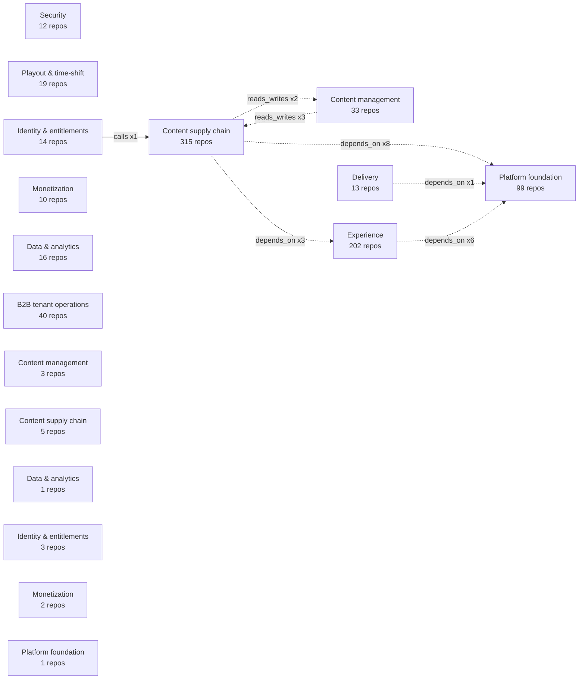

# TVaaS Architecture Overview

```mermaid
flowchart LR
  1__Content_supply_chain["Content supply chain\n315 repos"]
  10__Platform_foundation["Platform foundation\n99 repos"]
  11__Security["Security\n12 repos"]
  2__Content_management["Content management\n33 repos"]
  3__Playout___time_shift["Playout & time-shift\n19 repos"]
  4__Delivery["Delivery\n13 repos"]
  5__Identity___entitlements["Identity & entitlements\n14 repos"]
  6__Monetization["Monetization\n10 repos"]
  7__Experience["Experience\n202 repos"]
  8__Data___analytics["Data & analytics\n16 repos"]
  9__B2B_tenant_operations["B2B tenant operations\n40 repos"]
  Content_management["Content management\n3 repos"]
  Content_supply_chain["Content supply chain\n5 repos"]
  Data___analytics["Data & analytics\n1 repos"]
  Identity___entitlements["Identity & entitlements\n3 repos"]
  Monetization["Monetization\n2 repos"]
  Platform_foundation["Platform foundation\n1 repos"]
  1__Content_supply_chain -.->|depends_on x8| 10__Platform_foundation
  1__Content_supply_chain -.->|reads_writes x2| 2__Content_management
  1__Content_supply_chain -.->|depends_on x3| 7__Experience
  2__Content_management -.->|reads_writes x3| 1__Content_supply_chain
  4__Delivery -.->|depends_on x1| 10__Platform_foundation
  5__Identity___entitlements -->|calls x1| 1__Content_supply_chain
  7__Experience -.->|depends_on x6| 10__Platform_foundation
```