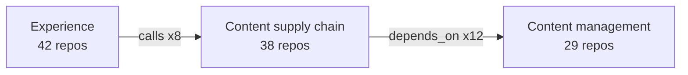
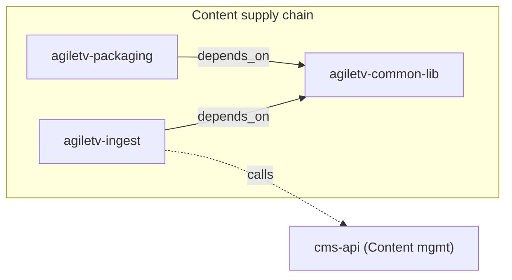

# Architecture Diagram Extraction — Design Spec

**Date**: 2026-06-17  
**Status**: Approved for implementation

---

## Context

The architecture viewer (`architecture-overview/index.html`) currently shows 784 repos classified into 11 domains and 42 subdomains, with GitHub team ownership. All edges in `architecture-graph.json` are organisational (`belongs_to`, `owns`) — there are no inter-service dependency edges.

This spec defines extracting actual architectural relationships from active repo source files and surfacing them as:
1. An interactive force-directed "Connections" view added to the existing viewer
2. Per-domain Mermaid diagram files suitable for Confluence/GitHub embedding

---

## Scope

**In scope:**
- Active repos only (non-dormant, non-archived — ~400 of 784)
- Three relationship sources: Maven `pom.xml`, Spring config `application.yml`/`application.properties`, npm `package.json`
- Two edge types: `depends_on` (build-time) and `calls` (runtime reference)
- Domain-level overview + service-level drill-down in the viewer
- One Mermaid file per domain + one overview file

**Out of scope:**
- Runtime telemetry (Istio/Envoy, Kafka topics)
- Database schema coupling
- Repos outside the configured orgs
- Re-classification of repos

---

## Architecture

```
scripts/extract_relationships.py
    │
    ├── 1. load_graph()          reads architecture-graph.json
    ├── 2. select_active()       filters non-dormant repo nodes
    ├── 3. fetch_build_files()   parallel GitHub API fetch per repo
    │        stores raw content in .cache/{repo}_files.json
    ├── 4. build_coord_map()     pom.xml → {groupId:artifactId → repo}
    ├── 5. extract_edges()       parse all three file types per repo
    ├── 6. update_graph()        merge new edges into architecture-graph.json
    ├── 7. generate_mermaid()    write architecture-overview/diagrams/*.md
    └── 8. extend_viewer()       inject D3 connections tab into index.html
```

The script runs **after** `scripts/pilot.py` and is independent of it. The existing `.cache/` directory is reused; file content is stored as `{repo-slug}_files.json` alongside classification caches.

---

## Data Model — New Edge Types

Two new edge types appended to the `edges` array in `architecture-graph.json`:

```json
{
  "source": "repo:agilecontent/ingest-service",
  "target": "repo:agilecontent/common-lib",
  "type": "depends_on",
  "confidence": "high",
  "evidence": ["pom.xml"],
  "detail": "com.agilecontent:common-lib:2.1.0"
}
```

```json
{
  "source": "repo:agilecontent/ingest-service",
  "target": "repo:agilecontent/cms-api",
  "type": "calls",
  "confidence": "medium",
  "evidence": ["application.yml"],
  "detail": "http://cms-api:8080/api/v1"
}
```

**Confidence levels:**
| Level | Condition |
|---|---|
| `high` | artifactId matched exactly to a repo's own declared coordinates |
| `medium` | URL hostname fuzzy-matched to a known repo name |
| `low` | env var name inference (`USER_SERVICE_URL` → `user-service`) |

---

## Extraction Logic

### Phase 1 — Coordinate Map (pom.xml)

Fetch `pom.xml` for all active repos. Parse each for the **project's own** groupId/artifactId:

```python
# Strip <parent>...</parent> block first to avoid picking up Spring Boot parent groupId
# Then extract first <groupId> + first <artifactId>
# Valid project groupIds: starts with "com.agilecontent" or "com.agiletv"
```

Known internal parent POM: `agile-java-base` (artifactId) — do not create edges for dependencies on this, it's infrastructure.

Result: `coord_map = {"com.agilecontent:common-lib": "agilecontent/common-lib", ...}`

### Phase 2 — Dependency Edges

**Maven** (`pom.xml` — `depends_on`, confidence `high`):
```
<dependency>
  <groupId>com.agilecontent</groupId>   ← matches prefix
  <artifactId>common-lib</artifactId>   ← look up in coord_map
  <version>2.1.0</version>
</dependency>
```
Match groupIds: `com.agilecontent.*` **or** `com.agiletv.*`

**Spring config** (`application.yml`/`.properties` — `calls`, confidence `medium`):
- Extract all string values matching `http(s)://[hostname]` or `${ENV_VAR:http(s)://[hostname]}`
- Normalise hostname to candidate repo names: `cms-api` → look for repos containing `cms-api`, `agiletv-cms-api`, etc.
- Fuzzy match: strip common prefixes (`agiletv-`, `agilecontent-`), compare with known repo short names

**npm** (`package.json` — `depends_on`, confidence `high`):
- Extract `dependencies` + `devDependencies` keys matching `@agilecontent/*` or `@agiletv/*`
- Package name → repo name: `@agilecontent/player-sdk` → look for repo `player-sdk`, `agiletv-player-sdk`, etc.

### Edge Deduplication

Multiple files in the same repo may yield the same logical edge. Deduplicate by `(source, target, type)` — keep the highest confidence, merge evidence arrays.

---

## Viewer Extension — "Connections" Tab

Add a toggle in the topbar: **Map** (existing) | **Connections** (new).

### Domain-level view (default)
- D3 force-directed graph of the 11 domain nodes
- Sized by repo count; positioned roughly matching the draw.io plane layout
- Edges between domains: bundled, thickness = relationship count, colour by type
  - `depends_on`: blue, dashed
  - `calls`: orange, solid
- Click domain → zooms into service-level view for that domain

### Service-level view (per domain)
- Triggered by clicking a domain node or the domain blocks in the existing map
- Nodes: repos in the selected domain + their direct neighbours (cross-domain)
- Cross-domain neighbours rendered at the border with a domain label
- Node colour: health tier (governed = green, ungoverned = orange, dormant = grey)
- Node border thickness: confidence of classification
- Edge hover: shows `detail` field (artifact version or URL)
- Click node: opens GitHub repo URL

### D3 integration
- Load D3 v7 from CDN with SRI hash
- Simulation: `forceLink` + `forceManyBody` + `forceCenter`
- No animation on hover/select (performance with 400+ nodes)
- "Back to domain view" breadcrumb button

---

## Mermaid Export Format

Written to `architecture-overview/diagrams/`:

**`overview.md`** — domain-level:
```markdown
# TVaaS Architecture Overview


```

**`domain-{n}-{slug}.md`** — per domain, service-level:
```markdown
# Domain: Content supply chain


```

Edge notation:
- `-->` solid arrow = `calls`
- `-.->` dashed arrow = `depends_on`
- Cross-domain targets shown in quotes with domain label

---

## Script Interface

```bash
# Full run (re-fetch files + extract + update graph + generate outputs)
.venv/bin/python -m scripts.extract_relationships

# Re-use cached files only (reads {repo}_files.json, skips GitHub API)
# Falls back to API fetch for repos not yet cached
.venv/bin/python -m scripts.extract_relationships --from-cache

# Extract only, skip viewer + Mermaid generation (useful for debugging edges)
.venv/bin/python -m scripts.extract_relationships --edges-only
```

Output summary printed on completion:
```
Active repos scanned:      387
Repos with build files:    143 (pom.xml: 62, package.json: 81)
Repos with config files:   54
Edges extracted:           312 (depends_on: 198, calls: 114)
High confidence:           201 / Medium: 89 / Low: 22
Cross-domain edges:        47
Diagrams written:          12 (overview + 11 domains)
```

---

## Running Order

```bash
# 1. Classify repos (already done)
.venv/bin/python -m scripts.pilot --all

# 2. Extract relationships (new)
.venv/bin/python -m scripts.extract_relationships

# 3. Viewer now has Connections tab + diagrams/ folder is populated
open architecture-overview/index.html
```

---

## Open Questions (resolved)

- **Internal groupId prefixes**: `com.agilecontent.*` and `com.agiletv.*` — confirmed from live pom.xml inspection
- **Spring Boot parent trap**: strip `<parent>` block before extracting project groupId — confirmed needed
- **Internal base POM**: `agile-java-base` — skip as dependency target (it's a parent POM, not a service)
- **tvopenplatform repos**: No pom.xml — likely Node.js, covered by npm parsing instead
